# hotel-management-system

This project a Java Swing-based application that enables users to effectively manage hotel reservations is the goal of the Hotel Booking Management System project. Customers and administrators alike will find this sys tem’s user-friendly interface convenient for carrying out several hotel reservation-related duties.

## User Interface

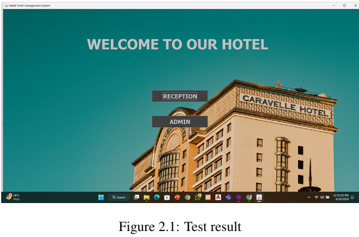

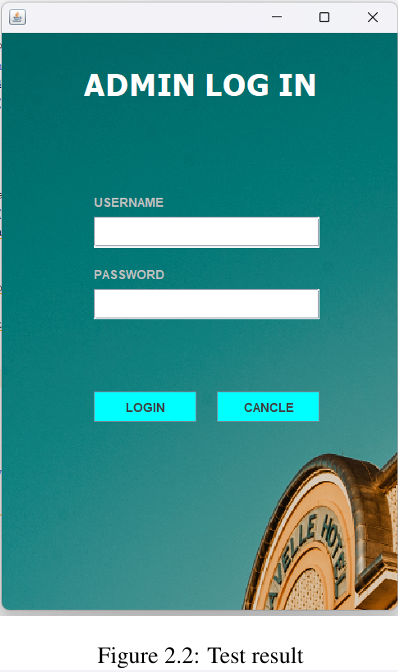

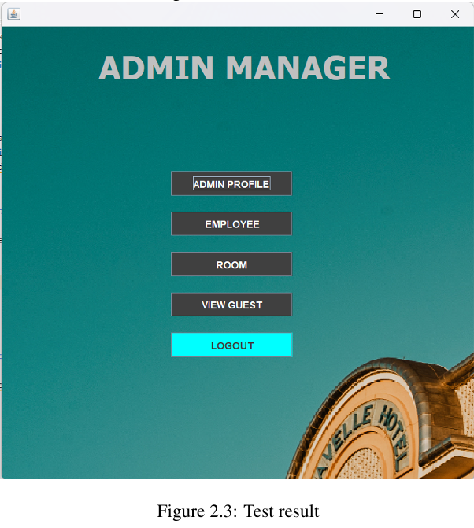

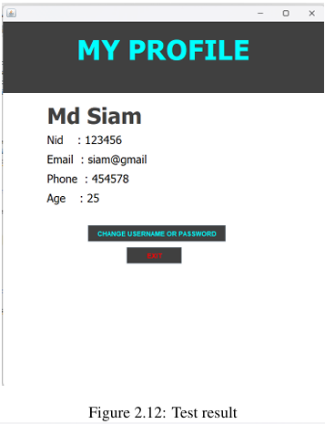

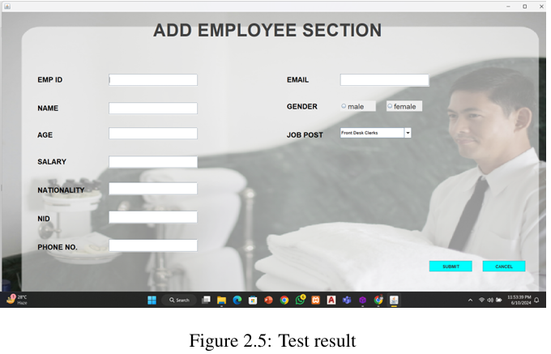

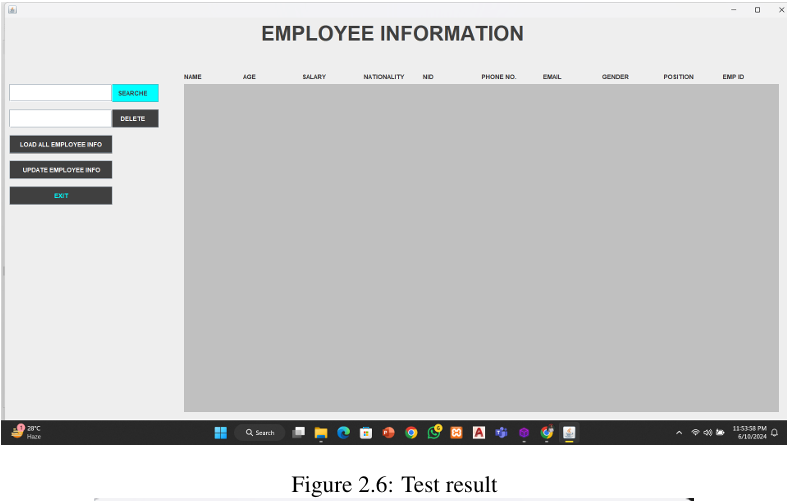

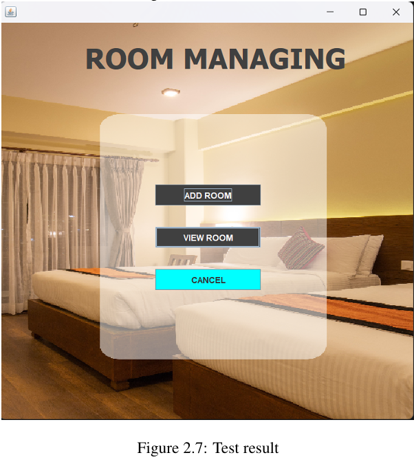

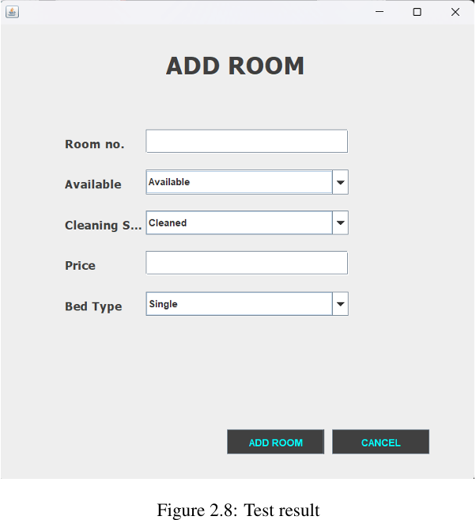

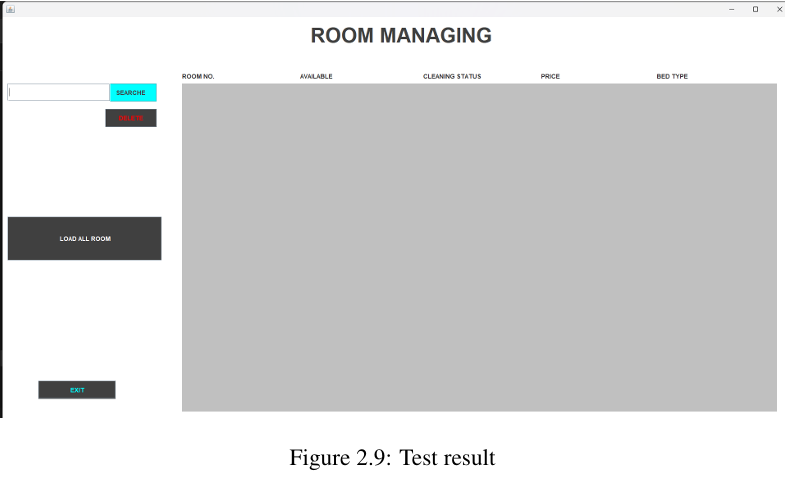

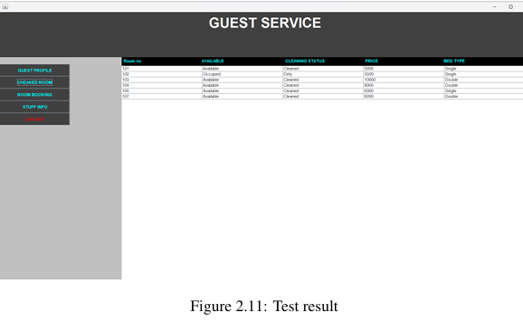

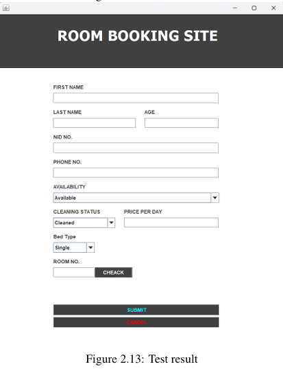

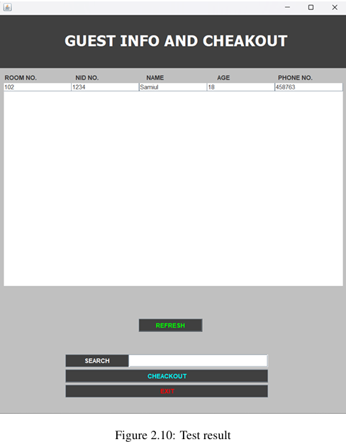
